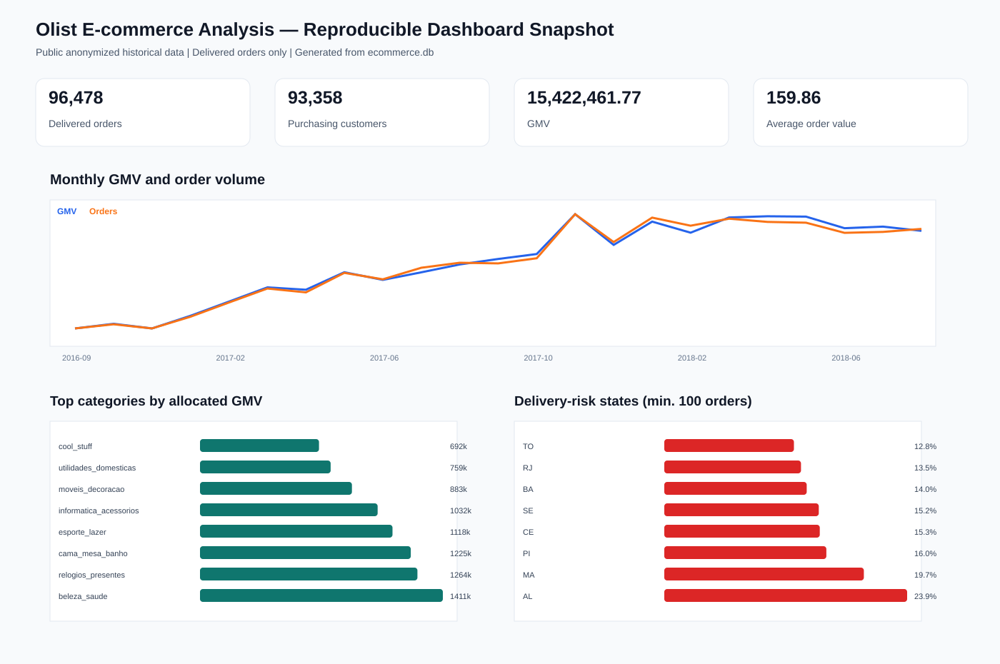
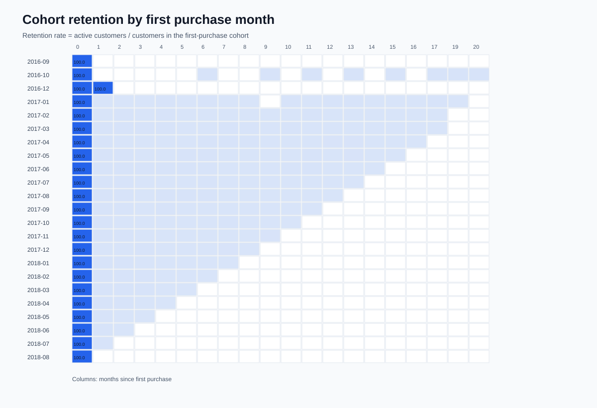

# 电商用户行为、复购与配送体验分析

面向数据分析实习的独立作品项目。项目使用 Olist Brazilian E-Commerce 的公开匿名数据，围绕订单增长、复购、品类表现与配送体验构建可复现的分析流程。

## 项目问题

1. 月度订单、GMV、客单价和活跃用户如何变化？
2. 用户首购后是否复购，留存表现如何？
3. 哪些品类、地区与支付方式贡献了订单和收入？
4. 配送时长和预计送达偏差是否与低评分有关？

## 技术栈

`SQL`、`Python`、`Pandas`、`SQLite`、`Power BI` / `Metabase`。

## 数据来源与边界

- 数据：Kaggle 的 [Brazilian E-Commerce Public Dataset by Olist](https://www.kaggle.com/datasets/olistbr/brazilian-ecommerce)。
- 数据为公开、匿名化的历史订单数据，不代表任何项目方的真实业务。
- 不将分析建议写成已经带来业务提升；所有数值结论必须由本项目生成的结果文件支持。

## 快速开始

1. 从上述数据集下载并解压 CSV 到 `data/raw/`。
2. 安装依赖：`python -m pip install -r requirements.txt`。
3. 构建订单粒度分析宽表与汇总表：`python src/build_mart.py`。
4. 用任意 SQLite 客户端打开 `data/analytics/ecommerce.db`，执行 `sql/kpi_queries.sql`。
5. 将 `data/analytics/` 下的 CSV 导入 Power BI 或 Metabase，按 `docs/dashboard_spec.md` 制作看板。

## 产出

- `data/analytics/fact_orders.csv`：订单粒度分析宽表。
- `data/analytics/monthly_kpi.csv`：月度经营指标。
- `data/analytics/cohort_retention.csv`：用户首购 cohort 留存表。
- `data/analytics/category_kpi.csv`：品类经营表现。
- `data/analytics/ecommerce.db`：供 SQL 查询和 BI 工具连接的 SQLite 数据库。
- `docs/metabase_validation.md`：本地 Metabase 看板的卡片清单与渲染验证记录。

## 复现证据

- 指标口径、数据范围与核心结果校验：[指标口径与复现证据](docs/metric_definitions.md)
- 可复现图表快照：[经营、品类与配送风险](docs/screenshots/dashboard_overview.svg)、[Cohort 留存](docs/screenshots/cohort_retention.svg)
- 生成命令：先运行 `python src/build_mart.py`，再运行 `python src/render_evidence.py`。

## 延伸案例

- [AI 产品运营分析与埋点体系建设](ai_product_analytics/README.md)：使用匿名合成事件数据展示埋点字典、漏斗分析、数据质量校验和 BI 看板设计；不包含任何公司业务数据。
